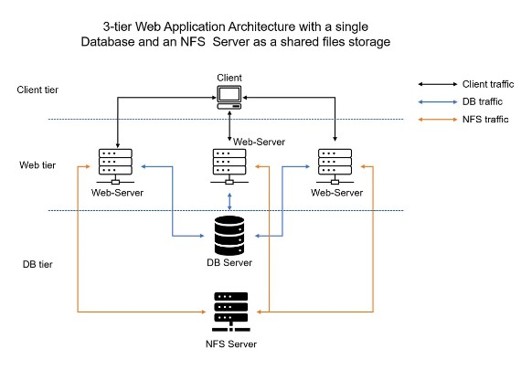
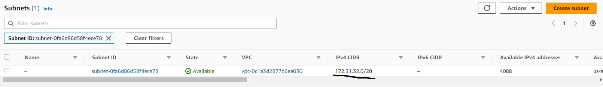

## DEVOPS TOOLING WEBSITE SOLUTION

In previous [Project-6](https://github.com/lekan675/project-6), I implemented a WordPress based solution that is ready to be filled with content and can be used as a full fledged website or blog. 

In this project, I will be adding more value to this solution by implementing a tooling website solution that makes access to DevOps tools within the corporate infrastructure easily accessible.

Setup and technologies used in Project 7
As a member of a DevOps team, you will implement a tooling website solution which makes access to DevOps tools within the corporate infrastructure easily accessible.

In this project you will implement a solution that consists of following components:

-   Infrastructure: AWS
-   Webserver Linux: Red Hat Enterprise Linux 8
-   Database Server: Ubuntu 20.04 + MySQL
-   Storage Server: Red Hat Enterprise Linux 8 + NFS Server
-   Programming Language: PHP
-   Code Repository: GitHub

**Prerequisites**

-   Knowledge of AWS core services and CLI
-   Basic knowledge of Linux commands and how to manage storage on a Linux server.
-   Basic knowledge of Network-attached storage (NAS), Storage Area Networks (SAN), and related protocols like NFS, FPT, SFTP, SMB, iSCSI.
-   Knowledge of Block-level storage and how it is used on the Cloud.

**Architecture**

We will be implementing a solution that comprises multiple web servers sharing a common database and also accessing the same files using Network File System (NFS) as shared file storage.

## STEP 1 – PREPARE NFS SERVER

1.  Spin up a new EC2 instance with RHEL Linux 8 Operating System.

2.  Based on your LVM experience from [Project-6](https://github.com/lekan675/project-6), Configure LVM on the Server.

-   Instead of formating the disks as ext4 you will have to format them as xfs

-   Ensure there are 3 Logical Volumes. lv-opt lv-apps, and lv-logs

3.  Create mount points on /mnt directory for the logical volumes as follow:
    
    Mount lv-apps on /mnt/apps – To be used by webservers

    Mount lv-logs on /mnt/logs – To be used by webserver logs

    Mount lv-opt on /mnt/opt – To be used by Jenkins server in Project 8

4.  Install NFS server, configure it to start on reboot and make sure it is up and running

    `sudo yum -y update`

    `sudo yum install nfs-utils -y`

    `sudo systemctl start nfs-server.service`

    `sudo systemctl enable nfs-server.service`

    `sudo systemctl status nfs-server.service`

    

5.  Export the mounts for webservers’ subnet cidr to connect as clients. For        simplicity, you will install your all three Web Servers inside the same subnet, but in production set up you would probably want to separate each tier inside its own subnet for higher level of security.

    To check your `subnet cidr` – open your EC2 details in AWS web console and locate ‘Networking’ tab and open a Subnet link:

    

    Make sure we set up permission that will allow our Web servers to read, write and execute files on NFS;

    `sudo chown -R nobody: /mnt/apps`

    `sudo chown -R nobody: /mnt/logs`

    `sudo chown -R nobody: /mnt/opt`

    `sudo chmod -R 777 /mnt/apps`

    `sudo chmod -R 777 /mnt/logs`

    `sudo chmod -R 777 /mnt/opt`

    `sudo systemctl restart nfs-server.service`

    Configure access to NFS for clients within the same subnet `(example of Subnet CIDR – 172.31.32.0/20 ):`

    `sudo vi /etc/exports`

    `/mnt/apps <Subnet-CIDR>(rw,sync,no_all_squash,no_root_squash)`
    `/mnt/logs <Subnet-CIDR>(rw,sync,no_all_squash,no_root_squash)`
    `/mnt/opt <Subnet-CIDR>(rw,sync,no_all_squash,no_root_squash)`

        Esc + :wq!

    `sudo exportfs -arv`

    

6.  Check which port is used by NFS and open it using Security Groups (add new Inbound Rule)

    `rpcinfo -p | grep nfs`

    

    **Important note**: In order for NFS server to be accessible from your client, you must also open following ports: TCP 111, UDP 111, UDP 2049

    

**Step 2 - Configure the Database Server**

1.  Launch a new EC2 instance and install MySQL server on this instance.

    

2.  Create a database and name it “tooling”

    
3.  Create a database user called “webaccess”

4.  Grant permission to this “webaccess” user to have full permissions on the “tooling” database only from the subnet cidr.

    

**Step 3 - Prepare the Web Servers**

In this step, we will be launching three web servers. We need to make sure that the web servers can serve the same content from shared storage solutions, which in this case are the MySQL database and NFS server.

For storing shared files that our Web Servers will use, we will utilize NFS and mount previously created logical Volume `lv-apps` to the folder where Apache stores files to be served to the users `(/var/www)`.

This approach will make our Web Servers `stateless`, means we will be able to add new ones or remove them whenever we need, and the integrity of the data (in the database and on NFS) will be preserved.

1.  Launch a new EC2 instance with RHEL 8 Operating System

2.  Install NFS client

    `sudo yum install nfs-utils nfs4-acl-tools -y`

    

3.  Mount /var/www/ and target the NFS server’s export for apps`

    `sudo mkdir /var/www`

    `sudo mount -t nfs -o rw,nosuid <NFS-Server-Private-IP-Address>:/mnt/apps /var/www`

    

4.  Verify that NFS was mounted successfully by running `df -h`. Make sure that the changes will persist on Web Server after reboot:

    `sudo vi /etc/fstab`

    

    add following line

    `<NFS-Server-Private-IP-Address>:/mnt/apps /var/www nfs defaults 0 0`

    

    

5. Install [Remi’s repository](http://www.servermom.org/how-to-enable-remi-repo-on-centos-7-6-and-5/2790/), Apache and PHP

    `sudo yum install httpd -y`

    `sudo dnf install https://dl.fedoraproject.org/pub/epel/epel-release-latest-8.noarch.rpm`

    `sudo dnf install dnf-utils http://rpms.remirepo.net/enterprise/remi-release-8.rpm`

    `sudo dnf module reset php`

    `sudo dnf module enable php:remi-7.4`

    `sudo dnf install php php-opcache php-gd php-curl php-mysqlnd`

    `sudo systemctl start php-fpm`

    `sudo systemctl enable php-fpm`

    `setsebool -P httpd_execmem 1`

    

**Repeat steps 1-5 for another 2 Web Servers.**

6.  Verify that Apache files and directories are available on the Web Server in `/var/www` and also on the NFS server in `/mnt/apps`. If you see the same files – it means NFS is mounted correctly. You can try to create a new file `touch test.txt` from one server and check if the same file is accessible from other Web Servers.

    

    

7.  Locate the log folder for Apache on the Web Server and mount it to NFS server’s export for logs. Repeat step №4 to make sure the mount point will persist after reboot.

    `sudo mount -t nfs -o rw,nosuid 172.31.43.80:/mnt/logs /var/log/httpd`

    

    

8.  Fork the tooling source code from [Darey.io Github Account](https://github.com/darey-io/tooling.git) to your Github account. (Learn how to fork a repo [here](https://youtu.be/f5grYMXbAV0))

9.  Deploy the tooling website’s code to the Webserver. Ensure that the html folder from the repository is deployed to `/var/www/html`

10. Update the website’s configuration to connect to the database (in /var/www/html/functions.php file). Apply tooling-db.sql script to your database using this command mysql -h <databse-private-ip> -u <db-username> -p <db-pasword> < tooling-db.sql

    

    
    
11. Create in MySQL a new admin user with username: myuser and password: password:

    `INSERT INTO ‘users’ (‘id’, ‘username’, ‘password’, ’email’, ‘user_type’, ‘status’) VALUES
-> (1, ‘myuser’, ‘5f4dcc3b5aa765d61d8327deb882cf99’, ‘user@mail.com’, ‘admin’, ‘1’);`

    

12. Open the website in your browser http://<Web-Server-Public-IP-Address-or-Public-DNS-Name>/index.php and make sure you can login into the website with myuser user.

    
    
    